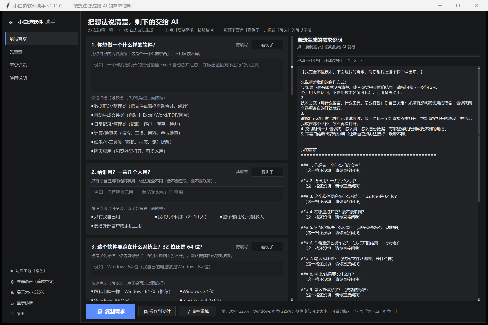
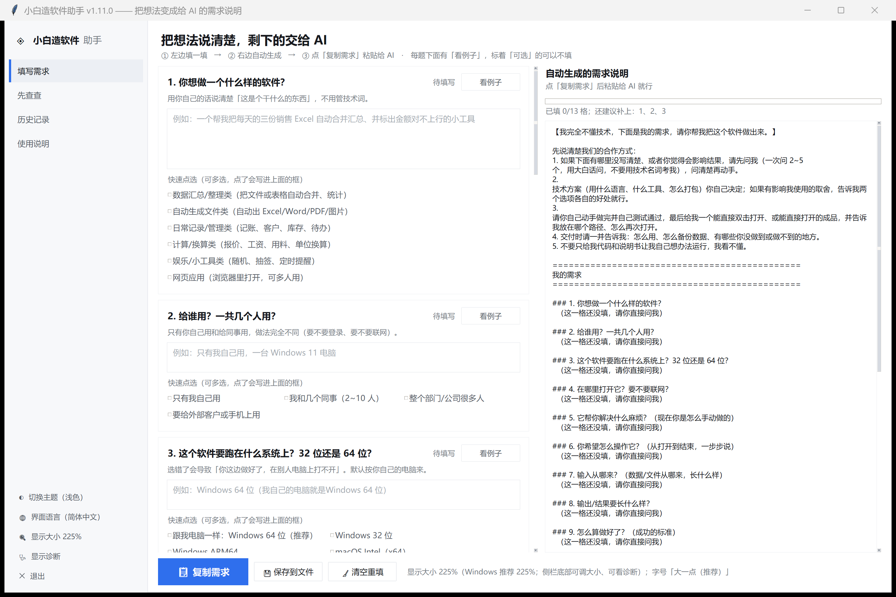
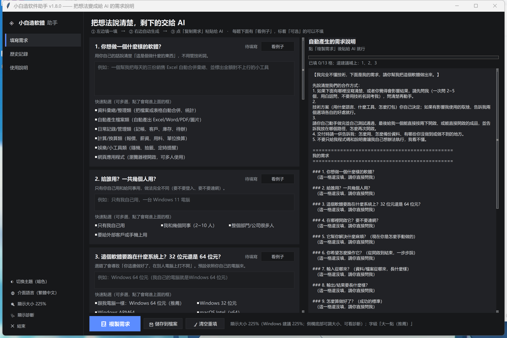
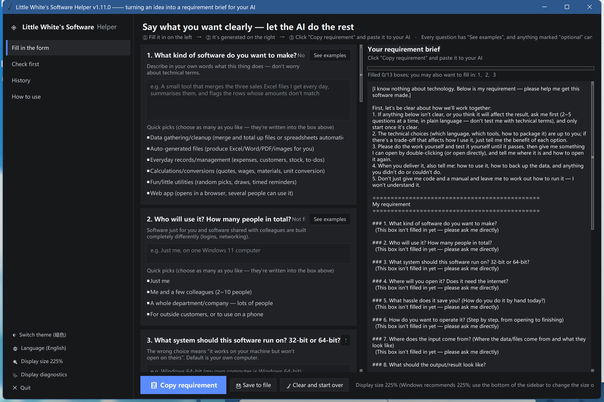
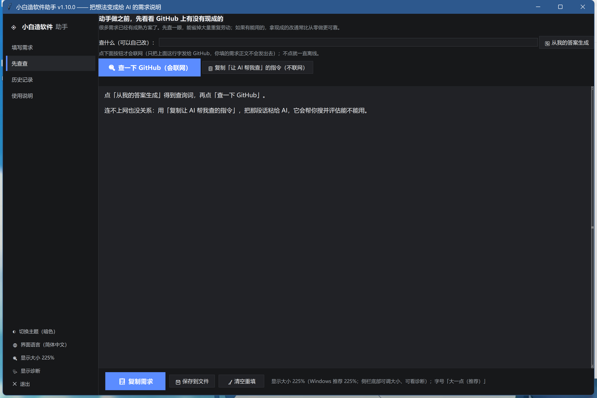

# 小白造软件助手

> 一个帮你**把"我想做个软件"说清楚**的 Windows 桌面小工具。
> 三语界面（简体 / 繁體 / English）；自动探测你的系统与位数作为默认目标。
> 不只是电脑软件 —— **手机 App（安卓 / iPhone / 鸿蒙）和网页**也能选。
> 它问你 13 个问题（能点选项就点，不必会打字），自动拼出一段完整的需求说明，
> 你复制粘贴给 AI，AI 就能开工了。
> 还能**先帮你查一下 GitHub 上有没有现成的**，避免重复造轮子。

专为**完全不懂编程**的人设计：双击即用、不登录、不需要账号。

**关于联网（写清楚，不含糊）：**

- 启动程序、填问卷、生成需求说明 —— **全程离线**，不碰网络。
- 只有一个地方会联网：「先查查」页里点「🔍 查一下 GitHub」时，
  会把你**那一行查询词**发给 GitHub 的公开搜索接口；点之前会先弹窗问你。
- **你填的需求正文不会发出去**，只发那一行你自己看得见、可以改的查询词。
- 不点就永远离线。连不上网也有替代方案：同一页可以复制一段
  「让 AI 帮我查」的指令，粘给 AI 让它去搜。

生成的那段文字里写死了「先问我 2~5 个问题再动手」「做完自己测试通过」
「不要只丢代码和说明书」这类合作方式，让 AI 高度自主地把活干完。





繁体与英文界面：





「先查查」页（动手前看 GitHub 有没有现成的）：



---

## 它是怎么工作的

```
① 左边填一填  →  ② 右边自动生成  →  ③ 点「复制需求」粘贴给 AI
```

13 个问题覆盖了决定成品能不能用的关键信息：

| # | 问题 | 为什么必须问 |
|---|---|---|
| 1 | 你想做一个什么样的软件 | 定方向 |
| 2 | 给谁用、几个人用 | 决定要不要登录 / 联网 |
| **3** | **跑在什么系统 / 手机 App / 网页；32 位还是 64 位** | **选错会导致「你这边做好了，别人打不开」。电脑（Windows/macOS/Linux）、手机（安卓/iOS/鸿蒙）、网页都能选，默认自动取你的电脑** |
| 4 | 在哪里打开、要不要联网 | 决定做成桌面程序还是网页 |
| 5 | 现在你是怎么手动做的 | 最有用的一格，越具体越贴合实际 |
| 6 | 你希望怎么操作它 | 你描述步骤，我照做界面 |
| 7 | 输入从哪来、长什么样 | 保证读得进、读得对 |
| 8 | 输出要长什么样 | 定验收标准 |
| 9 | 怎么算做好了 | 让我能自己测到对为止 |
| 10 | 什么不能做 / 什么规矩 | 防止动到不该动的数据 |
| 11 | 有没有参照物（可选） | 一个参照胜过形容半天 |
| 12 | 希望怎么交付（可选） | exe / 文件夹 / 网页 |
| 13 | 还想补充什么（可选） | 零散想法和担心 |

每格都带「为什么要填」的说明和「看例子」按钮；带蓝框的题可以直接勾选，
勾了自动写进输入框。填不完也没关系——生成的内容里会明确标出缺哪格，
AI 会回来问你。

---

## 功能

**问卷还会先问你「做的是什么类型」**：电脑程序 / 手机 App / 网页 /
**某个软件的插件** / 自动化脚本。选了「插件」，后面就**换一整套题** ——
不再问你 exe、32 位、怎么打包（那是做程序的事），而是问：

- **挂在哪个软件里**（示例直接举 DeepSeek Harness）
- 怎么触发它、你操作时它什么时候动
- 要不要跟被挂的那个软件交换信息（要不要用它的接口）
- 要不要设置界面
- 打算怎么装上、给谁用

插件的核心问题排在第 3~5 位，不会塞到最后 —— 填到第 12 题才被问
「你在做插件吗」早就放弃了。脚本类型同理（去掉交付类问题，加「怎么运行」）。

**问卷会按「要做什么平台」自适应**：第 3 题选了安卓 / iPhone / 鸿蒙 / 网页之后，
后面的问题会跟着变 —— 「在哪里打开」不再问 Windows 的事，
「怎么交付」会给你 apk / App Store / 网址这些对得上的选项，
「怎么算做好了」也换成该平台的验收标准。**宽泛选项（「不确定，你帮我选」）
在每个平台下都保留**，不会被去掉。改第 3 题后已填的内容不会丢。


- **先查查**：动手前先看 GitHub 上有没有现成的。
  自动把「你想做什么」压成检索词（并转成 GitHub 上更好搜的英文），
  搜完给判断：**建议用现成 / 值得先看看 / 自己做更省事**，
  列出星数、最近更新、许可证、是否已归档。
  结果**按相关性过滤**——GitHub 按星数排序时经常把无关的高星项目排在最前，
  只看星数会得出完全错误的结论

- **三语界面**：左下角可切换简体 / 繁體 / English，需求说明正文也跟着语言走
- **目标系统与位数**：自动探测你的电脑（Windows/macOS/Linux × 32/64 位）并作为默认值，写明后 AI 不会做错平台

- **引导式提问**：12 格表单 + 64 个快速点选选项 + 每格的填写理由与范例
- **实时生成**：右边随时显示会发给 AI 的那段完整需求
- **一键复制**：点「复制需求」（或 `Ctrl+Enter`）直接进剪贴板
- **历史记录**：保存过的需求可以整份还原回填写页继续改，不用重填
- **亮 / 暗双主题**：侧栏一键切换，默认暗色
- **分辨率自适应**：读取 Windows 缩放（4K 屏常见 150%~225%）等比放大；
  另有独立的「字号档位」旋钮，只放大文字不动布局
- **显示诊断**：字小 / 字糊时生成一份报告并直接给出结论

---

## 运行

### 方式一：直接跑源码（需要 Python 3.9+，仅用标准库）

```bash
python src/app.py
```

Windows 上还可以用调试模式看它探测到的分辨率与主题：

```bat
set XBSH_UI_DEBUG=1
python src/app.py
```

### 方式二：自己打包成 exe

```bat
build.bat
```

产物在 `dist\小白造软件助手\` 里，双击其中的 exe 即可。
（这个文件夹要整体保留，`_internal` 不能删。）

### 方式三：下载现成的 exe

到本仓库的 [Releases](../../releases) 页面下载由 GitHub Actions 自动构建的压缩包。

> **首次打开被 Windows 拦住了？**
> 因为 exe 没有代码签名，Windows 会提示「已保护你的电脑」。
> 点「更多信息」→「仍要运行」即可。这是"未知发布者"提示，不是病毒警告。
> 想少点几次，可以先双击文件夹里的 `unblock.bat` 去掉「来自网络」标记。
> 如果双击 exe 没反应，改双击 `launch.bat`。

---

### 方式四：双击安装程序（可以自己选装到哪）

installer/dist/xiaobai-software-helper-setup.exe 是一个安装向导：

1. 双击运行，**点「浏览」自己选安装位置**（也能直接改地址栏）
2. 勾选要不要桌面快捷方式、装完要不要马上打开
3. 安装完成 → 桌面/开始菜单就有了

**默认装在 %LOCALAPPDATA%\Programs\小白造软件助手**，故意不用
Program Files：那个目录要管理员权限，而且装完是只读的。

> 如果你偏要装到 Program Files，安装器会明确提示；程序本身也做了兼容 ——
> 它会发现程序目录写不进去，自动把**存档和配置**放到
> %APPDATA%\小白造软件助手。侧栏底部有「📁 存档保存在哪」可以看实际路径。

**卸载**：双击安装目录里的 Uninstall.bat。
卸载**不会删你的存档**（存档在用户目录，是你的资料）。

命令行也能装（给想脚本化部署的人）：

`
xiaobai-software-helper-setup.exe --list                    # 只列出会装什么
xiaobai-software-helper-setup.exe --install-to D:\MyApp     # 直接装到指定目录
xiaobai-software-helper-setup.exe --uninstall               # 卸载
`

## 命令行工具参数

排查显示问题时用（平时不需要）：

```bat
小白造软件助手.exe --ui-scale 1.75      :: 强制界面缩放为 175%
小白造软件助手.exe --font-boost 1.30    :: 强制字号档位为 1.30
```

也可以用环境变量临时覆盖（不改任何配置文件）：

| 变量 | 作用 |
|---|---|
| `XBSH_UI_SCALE` | 覆盖界面缩放，如 `1.5` |
| `XBSH_FONT_BOOST` | 覆盖字号档位，如 `1.15` |
| `XBSH_THEME` | 强制主题：`dark` / `light` |
| `XBSH_UI_SCREEN` | 模拟屏幕尺寸，如 `3840x2160`（验证 4K 表现） |
| `XBSH_UI_DEBUG=1` | 启动时打印探测到的 DPI / 缩放 / 主题 |
| `XBSH_UI_DIAGNOSE=1` | 启动后直接把显示诊断报告写到文件 |

---

## 开发与自检

改完代码建议把下面几个跑一遍（都是纯标准库，不需要额外依赖）：

```bat
python tools\selftest_functional.py     :: 功能 24 项：选项联动、剪贴板、存档、历史还原
python tools\selftest_ui_scale.py 1.0 1.5 2.25
                                        :: 缩放：字号行高、输入框高度是否等比
python tools\selftest_scroll.py         :: 滚动：落点准确性 + 有无残影
python tools\selftest_wheel.py          :: 滚轮：指针在不同控件上该滚哪个区域
python tools\generate_sample.py         :: 用一套真实需求生成示范输出
python tools\screenshot.py dark         :: 截图到 assets/（改 UI 后用它核对）
```

`screenshot.py` 需要 Pillow（`pip install pillow`）；其余只用标准库。

### 目录结构

```
.
├─ src/app.py                  程序本体（单文件，含界面、主题、生成逻辑）
├─ tools/                      自检、截图、示范生成脚本
├─ assets/                     截图
├─ packaging/                  随发布包一起分发的辅助脚本
│   ├─ launch.bat              备用启动入口（被 SmartScreen 拦时用）
│   └─ unblock.bat             去掉文件「来自网络」标记
├─ build.bat                   本机打包成 exe
├─ run_dev.bat                 直接跑源码
└─ .github/workflows/build.yml 推 tag 时自动构建 exe
```

运行数据（`config.json`、`需求存档/`）默认落在程序所在目录，不进版本库。

---

## 已知限制

- **没有圆角、没有阴影**：界面用的是 Tk 原生控件，观感是干净的扁平工具，
  不是网页那种圆角卡片。要圆角得把每个控件都画在画布上，
  代价是失去原生输入框（中文输入法、右键菜单都会出问题）且滚动残影更严重。
- **快速拖滚动条时可能有轻微残影**：表单区有 185 个控件，一次完整重绘约 6~7ms。
  已做限流（每 33ms 最多重绘一次，实测拖拽 120 个事件从 865ms 降到 115ms），
  但没有彻底消除。
- **单文件 exe 打包不出来**：部分环境下 PyInstaller onefile 会报
  `Could not create temporary directory`，所以采用文件夹模式。
- **中文字体**：界面用系统自带的「Microsoft YaHei UI」，非中文 Windows 上会自动降级。

---

## 许可

[MIT](LICENSE) —— 随便用，改了也不用告诉我。

配色是自建的一套中性灰 + 强调色色板（见 `src/app.py` 顶部的 `THEMES`），
不依赖任何第三方设计系统。
